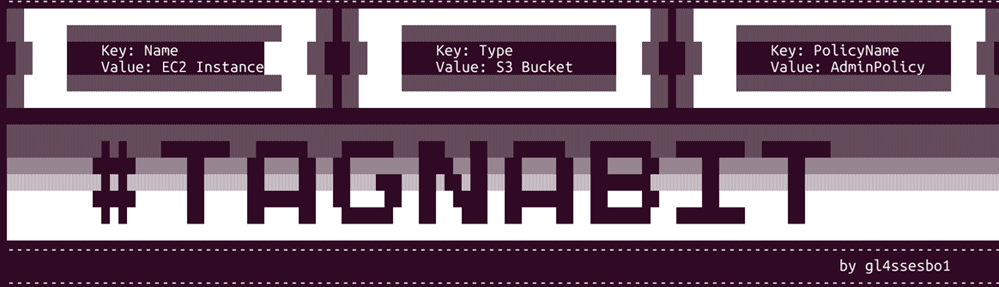
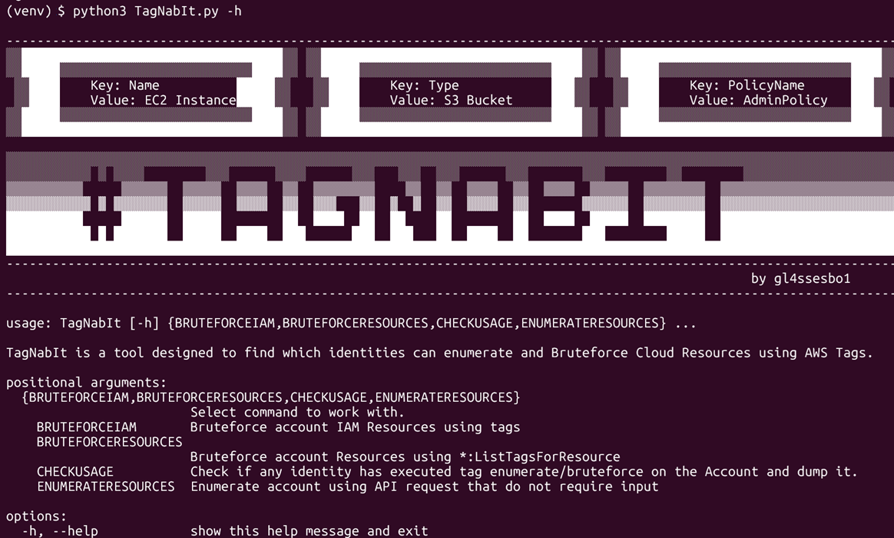

# TagNabIt


## Table of Contents

- [Introduction](#introduction)
- [Installation](#installation)
  - [Local Installation](#local-installation)
  - [Docker Installation](#docker-installation)
- [Usage](#usage)
  - [ENUMERATERESOURCES](#enumerateresources)
  - [BRUTEFORCEIAM](#bruteforceiam)
  - [BRUTEFORCERESOURCES](#bruteforceresources)
  - [CHECKUSAGE](#checkusage)
- [License](#license)

## Introduction
TagNabIt is a tool built to enumerate Cloud Resources using tags
**Release Blog:** [[A tag to rule them all: Using tags to enumerate cloud resources](https://blog.pepperclipp.com/pepperclipp-public/a-tag-to-rule-them-all-using-aws-tags-to-enumerate-cloud-resources)]

## Installation
### Local Installation
To install, the only thing needed, is to install the required libraries.
````
python3 -m venv ./venv
source venv/bin/activate
python3 -m pip install -r requirements.txt
````
Then, just run the tool by running **TagNabIt.py**:
````
$ python3 TagNabIt.py -h

--------------------------------------------------------------------------------------------------------------------
░░██████████████████████████████████░░ ░░██████████████████████████████████░░ ░░██████████████████████████████████░░
░░█████░░░░░░░░░░░░░░░░░░░░░░░░░████░░ ░░█████░░░░░░░░░░░░░░░░░░░░░░░░░████░░ ░░█████░░░░░░░░░░░░░░░░░░░░░░░░░████░░
 ░░████    Key: Name          █████░░   ░░████    Key: Type            ███░░   ░░████    Key: PolicyName      ███░░
 ░░████    Value: EC2 Instance█████░░   ░░████    Value: S3 Bucket     ███░░   ░░████    Value: AdminPolicy   ███░░
░░█████░░░░░░░░░░░░░░░░░░░░░░░░░████░░ ░░█████░░░░░░░░░░░░░░░░░░░░░░░░░████░░ ░░█████░░░░░░░░░░░░░░░░░░░░░░░░░████░░
░░██████████████████████████████████░░ ░░██████████████████████████████████░░ ░░██████████████████████████████████░░

░░░░░░░░░░░░░░░░░░░░░░░░░░░░░░░░░░░░░░░░░░░░░░░░░░░░░░░░░░░░░░░░░░░░░░░░░░░░░░░░░░░░░░░░░░░░░░░░░░░░░░░░░░░░░░░░░░░░
░░░░░░░░░░░ ░ ░░░░        ░░░      ░░░░      ░░░   ░░░  ░░░      ░░░       ░░░        ░░        ░░░░░░░░░░░░░░░░░░░░
▒▒▒▒▒▒▒▒▒▒     ▒▒▒▒▒▒  ▒▒▒▒▒  ▒▒▒▒  ▒▒  ▒▒▒▒▒▒▒▒    ▒▒  ▒▒  ▒▒▒▒  ▒▒  ▒▒▒▒  ▒▒▒▒▒  ▒▒▒▒▒▒▒▒  ▒▒▒▒▒▒▒▒▒▒▒▒▒▒▒▒▒▒▒▒▒▒▒
▓▓▓▓▓▓▓▓▓▓▓ ▓ ▓▓▓▓▓▓▓  ▓▓▓▓▓  ▓▓▓▓  ▓▓  ▓▓▓   ▓▓  ▓  ▓  ▓▓  ▓▓▓▓  ▓▓       ▓▓▓▓▓▓  ▓▓▓▓▓▓▓▓  ▓▓▓▓▓▓▓▓▓▓▓▓▓▓▓▓▓▓▓▓▓▓▓
██████████     ██████  █████        ██  ████  ██  ██    ██        ██  ████  █████  ████████  ███████████████████████
███████████ █ ███████  █████  ████  ███      ███  ███   ██  ████  ██       ███        █████  ███████████████████████
████████████████████████████████████████████████████████████████████████████████████████████████████████████████████
--------------------------------------------------------------------------------------------------------------------
                                                                                                 by gl4ssesbo1
--------------------------------------------------------------------------------------------------------------------

usage: TagNabIt [-h] {BRUTEFORCEIAM,BRUTEFORCERESOURCES,CHECKUSAGE,ENUMERATERESOURCES} ...

TagNabIt is a tool designed to find which identities can enumerate and Bruteforce Cloud Resources using AWS Tags.

positional arguments:
  {BRUTEFORCEIAM,BRUTEFORCERESOURCES,CHECKUSAGE,ENUMERATERESOURCES}
                        Select command to work with.
    BRUTEFORCEIAM       Bruteforce account IAM Resources using tags
    BRUTEFORCERESOURCES
                        Bruteforce account Resources using service specific tag API calls
    CHECKUSAGE          Check if any identity has executed tag enumerate/bruteforce on the Account and dump it.
    ENUMERATERESOURCES  Enumerate account using API request that do not require input

options:
  -h, --help            show this help message and exit
````
### Docker Installation
A Dockerfile is placed inside the main directory of the project. To build the image, inside the main directory of the project run:
````
docker build -t tagnabit .
````
Then run the container with directories **output** and **~/.aws** mounted to host:
````
$ docker run -v ~/.aws:/root/.aws -v ./output:/tagnabit/output -it tagnabit -h

--------------------------------------------------------------------------------------------------------------------
░░██████████████████████████████████░░ ░░██████████████████████████████████░░ ░░██████████████████████████████████░░
░░█████░░░░░░░░░░░░░░░░░░░░░░░░░████░░ ░░█████░░░░░░░░░░░░░░░░░░░░░░░░░████░░ ░░█████░░░░░░░░░░░░░░░░░░░░░░░░░████░░
 ░░████    Key: Name          █████░░   ░░████    Key: Type            ███░░   ░░████    Key: PolicyName      ███░░
 ░░████    Value: EC2 Instance█████░░   ░░████    Value: S3 Bucket     ███░░   ░░████    Value: AdminPolicy   ███░░
░░█████░░░░░░░░░░░░░░░░░░░░░░░░░████░░ ░░█████░░░░░░░░░░░░░░░░░░░░░░░░░████░░ ░░█████░░░░░░░░░░░░░░░░░░░░░░░░░████░░
░░██████████████████████████████████░░ ░░██████████████████████████████████░░ ░░██████████████████████████████████░░

░░░░░░░░░░░░░░░░░░░░░░░░░░░░░░░░░░░░░░░░░░░░░░░░░░░░░░░░░░░░░░░░░░░░░░░░░░░░░░░░░░░░░░░░░░░░░░░░░░░░░░░░░░░░░░░░░░░░
░░░░░░░░░░░ ░ ░░░░        ░░░      ░░░░      ░░░   ░░░  ░░░      ░░░       ░░░        ░░        ░░░░░░░░░░░░░░░░░░░░
▒▒▒▒▒▒▒▒▒▒     ▒▒▒▒▒▒  ▒▒▒▒▒  ▒▒▒▒  ▒▒  ▒▒▒▒▒▒▒▒    ▒▒  ▒▒  ▒▒▒▒  ▒▒  ▒▒▒▒  ▒▒▒▒▒  ▒▒▒▒▒▒▒▒  ▒▒▒▒▒▒▒▒▒▒▒▒▒▒▒▒▒▒▒▒▒▒▒
▓▓▓▓▓▓▓▓▓▓▓ ▓ ▓▓▓▓▓▓▓  ▓▓▓▓▓  ▓▓▓▓  ▓▓  ▓▓▓   ▓▓  ▓  ▓  ▓▓  ▓▓▓▓  ▓▓       ▓▓▓▓▓▓  ▓▓▓▓▓▓▓▓  ▓▓▓▓▓▓▓▓▓▓▓▓▓▓▓▓▓▓▓▓▓▓▓
██████████     ██████  █████        ██  ████  ██  ██    ██        ██  ████  █████  ████████  ███████████████████████
███████████ █ ███████  █████  ████  ███      ███  ███   ██  ████  ██       ███        █████  ███████████████████████
████████████████████████████████████████████████████████████████████████████████████████████████████████████████████
--------------------------------------------------------------------------------------------------------------------
                                                                                                 by gl4ssesbo1
--------------------------------------------------------------------------------------------------------------------

usage: TagNabIt [-h] {BRUTEFORCEIAM,BRUTEFORCERESOURCES,CHECKUSAGE,ENUMERATERESOURCES} ...

TagNabIt is a tool designed to find which identities can enumerate and Bruteforce Cloud Resources using AWS Tags.

positional arguments:
  {BRUTEFORCEIAM,BRUTEFORCERESOURCES,CHECKUSAGE,ENUMERATERESOURCES}
                        Select command to work with.
    BRUTEFORCEIAM       Bruteforce account IAM Resources using tags
    BRUTEFORCERESOURCES
                        Bruteforce account Resources using service specific tag API calls
    CHECKUSAGE          Check if any identity has executed tag enumerate/bruteforce on the Account and dump it.
    ENUMERATERESOURCES  Enumerate account using API request that do not require input

options:
  -h, --help            show this help message and exit
````

## Usage
TagNabIt is the culmination of all the research. The tool is a `4 parter` tool able to:

- Enumerate resources using `tag:GetResources`
- Bruteforce IAM Resources using tag related calls
- Bruteforce other resources using `*:ListTagsForResource` or `*:ListTagsForResources`
- Search CloudTrail Logs for occurrences of tag based enumeration
### ENUMERATERESOURCES
`TagNabIt` will use API calls that do not require known input to list resources, which include:

- `tag:GetResources`
- `ecr:DescribeImageTags`
- `ce:GetTags`, requiring `TimePeriod` as an input
- `ce:ListCostAllocationTags`
- `ec2:DescribeTags`
- `lakeformation:ListLFTags`
- `autoscaling:DescribeTags`
- `discovery:DescribeTags`
- `redshift:DescribeTags`
```commandline
$ python3 TagNabIt.py ENUMERATERESOURCES

--------------------------------------------------------------------------------------------------------------------
░░██████████████████████████████████░░ ░░██████████████████████████████████░░ ░░██████████████████████████████████░░
░░█████░░░░░░░░░░░░░░░░░░░░░░░░░████░░ ░░█████░░░░░░░░░░░░░░░░░░░░░░░░░████░░ ░░█████░░░░░░░░░░░░░░░░░░░░░░░░░████░░
 ░░████    Key: Name          █████░░   ░░████    Key: Type            ███░░   ░░████    Key: PolicyName      ███░░
 ░░████    Value: EC2 Instance█████░░   ░░████    Value: S3 Bucket     ███░░   ░░████    Value: AdminPolicy   ███░░
░░█████░░░░░░░░░░░░░░░░░░░░░░░░░████░░ ░░█████░░░░░░░░░░░░░░░░░░░░░░░░░████░░ ░░█████░░░░░░░░░░░░░░░░░░░░░░░░░████░░
░░██████████████████████████████████░░ ░░██████████████████████████████████░░ ░░██████████████████████████████████░░

░░░░░░░░░░░░░░░░░░░░░░░░░░░░░░░░░░░░░░░░░░░░░░░░░░░░░░░░░░░░░░░░░░░░░░░░░░░░░░░░░░░░░░░░░░░░░░░░░░░░░░░░░░░░░░░░░░░░
░░░░░░░░░░░ ░ ░░░░        ░░░      ░░░░      ░░░   ░░░  ░░░      ░░░       ░░░        ░░        ░░░░░░░░░░░░░░░░░░░░
▒▒▒▒▒▒▒▒▒▒     ▒▒▒▒▒▒  ▒▒▒▒▒  ▒▒▒▒  ▒▒  ▒▒▒▒▒▒▒▒    ▒▒  ▒▒  ▒▒▒▒  ▒▒  ▒▒▒▒  ▒▒▒▒▒  ▒▒▒▒▒▒▒▒  ▒▒▒▒▒▒▒▒▒▒▒▒▒▒▒▒▒▒▒▒▒▒▒
▓▓▓▓▓▓▓▓▓▓▓ ▓ ▓▓▓▓▓▓▓  ▓▓▓▓▓  ▓▓▓▓  ▓▓  ▓▓▓   ▓▓  ▓  ▓  ▓▓  ▓▓▓▓  ▓▓       ▓▓▓▓▓▓  ▓▓▓▓▓▓▓▓  ▓▓▓▓▓▓▓▓▓▓▓▓▓▓▓▓▓▓▓▓▓▓▓
██████████     ██████  █████        ██  ████  ██  ██    ██        ██  ████  █████  ████████  ███████████████████████
███████████ █ ███████  █████  ████  ███      ███  ███   ██  ████  ██       ███        █████  ███████████████████████
████████████████████████████████████████████████████████████████████████████████████████████████████████████████████                              
--------------------------------------------------------------------------------------------------------------------
                                                                                                 by gl4ssesbo1
--------------------------------------------------------------------------------------------------------------------

[*] Testing Account 012345678912...
[*] Enumerating AWS Resources using tag:GetResources...
[*] ------------------------------------------------------------!
[*]   Enumerate using tag:GetResources!
[*] ------------------------------------------------------------!
[*] -----------------------------------------------------------------------------------!
[*]   arn:aws:secretsmanager:us-east-1:012345678912:secret/somesecretvalue!
[*] -----------------------------------------------------------------------------------!
[*] Tags...
        [*] Environment:prod
        [*] Identity:AdministrativeUser


[*] ------------------------------------------------------------!
[*]   Enumerate using ec2:DescribeTags!
[*] ------------------------------------------------------------!
[*] ---------------------!
[*]   igw-012345678912abcdef012345!
[*] ---------------------!
[*] Tags...
        [*] Environment:prod


[*] ------------------------------------------------------------!
[*]   Enumerate using ce:GetTags!
[*] ------------------------------------------------------------!
[*] No tags found using lakeformation:ListLFTags!

[*] ------------------------------------------------------------!
[*]   Enumerate using lakeformation:ListLFTags!
[*] ------------------------------------------------------------!
[*] No tags found using lakeformation:ListLFTags!


[*] ------------------------------------------------------------!
[*]   Enumerate using autoscaling:DescribeTags!
[*] ------------------------------------------------------------!
[*] No tags found using autoscaling:DescribeTags!


[*] ------------------------------------------------------------!
[*]   Enumerate using discovery:DescribeTags!
[*] ------------------------------------------------------------!
[*] No tags found using discovery:DescribeTags!


[*] ------------------------------------------------------------!
[*]   Enumerate using redshift:DescribeTags!
[*] ------------------------------------------------------------!
[*] No tags found using redshift:DescribeTags

```
### BRUTEFORCEIAM
Since IAM uses specific API calls and input to list resources and tags, it would be good to have a separate tool section to bruteforce IAM Resources. They will be using the IAM specific API calls, which will list all 8 Resource types allowed in IAM.
```commandline
list_instance_profile_tags: Requires InstanceProfileName
ist_mfa_device_tags: Requires SerialNumber
list_open_id_connect_provider_tags: Requires OpenIDConnectProviderArn
list_policy_tags: Requires PolicyArn
list_role_tags: Requires RoleName
list_saml_provider_tags: Requires SAMLProviderArn
list_server_certificate_tags: Requires ServerCertificateName
list_user_tags: Requires UserName
```
```commandline
python3 TagNabIt.py BRUTEFORCEIAM -rf ../iamresources.txt -rt user -r us-east-1

--------------------------------------------------------------------------------------------------------------------
░░██████████████████████████████████░░ ░░██████████████████████████████████░░ ░░██████████████████████████████████░░
░░█████░░░░░░░░░░░░░░░░░░░░░░░░░████░░ ░░█████░░░░░░░░░░░░░░░░░░░░░░░░░████░░ ░░█████░░░░░░░░░░░░░░░░░░░░░░░░░████░░
 ░░████    Key: Name          █████░░   ░░████    Key: Type            ███░░   ░░████    Key: PolicyName      ███░░
 ░░████    Value: EC2 Instance█████░░   ░░████    Value: S3 Bucket     ███░░   ░░████    Value: AdminPolicy   ███░░
░░█████░░░░░░░░░░░░░░░░░░░░░░░░░████░░ ░░█████░░░░░░░░░░░░░░░░░░░░░░░░░████░░ ░░█████░░░░░░░░░░░░░░░░░░░░░░░░░████░░
░░██████████████████████████████████░░ ░░██████████████████████████████████░░ ░░██████████████████████████████████░░

░░░░░░░░░░░░░░░░░░░░░░░░░░░░░░░░░░░░░░░░░░░░░░░░░░░░░░░░░░░░░░░░░░░░░░░░░░░░░░░░░░░░░░░░░░░░░░░░░░░░░░░░░░░░░░░░░░░░
░░░░░░░░░░░ ░ ░░░░        ░░░      ░░░░      ░░░   ░░░  ░░░      ░░░       ░░░        ░░        ░░░░░░░░░░░░░░░░░░░░
▒▒▒▒▒▒▒▒▒▒     ▒▒▒▒▒▒  ▒▒▒▒▒  ▒▒▒▒  ▒▒  ▒▒▒▒▒▒▒▒    ▒▒  ▒▒  ▒▒▒▒  ▒▒  ▒▒▒▒  ▒▒▒▒▒  ▒▒▒▒▒▒▒▒  ▒▒▒▒▒▒▒▒▒▒▒▒▒▒▒▒▒▒▒▒▒▒▒
▓▓▓▓▓▓▓▓▓▓▓ ▓ ▓▓▓▓▓▓▓  ▓▓▓▓▓  ▓▓▓▓  ▓▓  ▓▓▓   ▓▓  ▓  ▓  ▓▓  ▓▓▓▓  ▓▓       ▓▓▓▓▓▓  ▓▓▓▓▓▓▓▓  ▓▓▓▓▓▓▓▓▓▓▓▓▓▓▓▓▓▓▓▓▓▓▓
██████████     ██████  █████        ██  ████  ██  ██    ██        ██  ████  █████  ████████  ███████████████████████
███████████ █ ███████  █████  ████  ███      ███  ███   ██  ████  ██       ███        █████  ███████████████████████
████████████████████████████████████████████████████████████████████████████████████████████████████████████████████                              
--------------------------------------------------------------------------------------------------------------------
                                                                                                 by gl4ssesbo1
--------------------------------------------------------------------------------------------------------------------

[*] Testing Account 012345678912...
[*] Bruteforcing IAM users...
[*] Resource Found: 'someUser'!
{
    "Tags": [
        {
            "Key": "Environment",
            "Value": "Prod"
        }
    ],
    "IsTruncated": false
}
```
### BRUTEFORCERESOURCES
Bruteforcing Resources will be achieved for 255 services, and return an error in case there is a mistake with the ID format, or the API call for the function does not exist.
```commandline
$ python3 TagNabIt.py BRUTEFORCERESOURCES -rf ../cloudtrailresources.txt -s cloudtrail -r us-east-1 -v

--------------------------------------------------------------------------------------------------------------------
░░██████████████████████████████████░░ ░░██████████████████████████████████░░ ░░██████████████████████████████████░░
░░█████░░░░░░░░░░░░░░░░░░░░░░░░░████░░ ░░█████░░░░░░░░░░░░░░░░░░░░░░░░░████░░ ░░█████░░░░░░░░░░░░░░░░░░░░░░░░░████░░
 ░░████    Key: Name          █████░░   ░░████    Key: Type            ███░░   ░░████    Key: PolicyName      ███░░
 ░░████    Value: EC2 Instance█████░░   ░░████    Value: S3 Bucket     ███░░   ░░████    Value: AdminPolicy   ███░░
░░█████░░░░░░░░░░░░░░░░░░░░░░░░░████░░ ░░█████░░░░░░░░░░░░░░░░░░░░░░░░░████░░ ░░█████░░░░░░░░░░░░░░░░░░░░░░░░░████░░
░░██████████████████████████████████░░ ░░██████████████████████████████████░░ ░░██████████████████████████████████░░

░░░░░░░░░░░░░░░░░░░░░░░░░░░░░░░░░░░░░░░░░░░░░░░░░░░░░░░░░░░░░░░░░░░░░░░░░░░░░░░░░░░░░░░░░░░░░░░░░░░░░░░░░░░░░░░░░░░░
░░░░░░░░░░░ ░ ░░░░        ░░░      ░░░░      ░░░   ░░░  ░░░      ░░░       ░░░        ░░        ░░░░░░░░░░░░░░░░░░░░
▒▒▒▒▒▒▒▒▒▒     ▒▒▒▒▒▒  ▒▒▒▒▒  ▒▒▒▒  ▒▒  ▒▒▒▒▒▒▒▒    ▒▒  ▒▒  ▒▒▒▒  ▒▒  ▒▒▒▒  ▒▒▒▒▒  ▒▒▒▒▒▒▒▒  ▒▒▒▒▒▒▒▒▒▒▒▒▒▒▒▒▒▒▒▒▒▒▒
▓▓▓▓▓▓▓▓▓▓▓ ▓ ▓▓▓▓▓▓▓  ▓▓▓▓▓  ▓▓▓▓  ▓▓  ▓▓▓   ▓▓  ▓  ▓  ▓▓  ▓▓▓▓  ▓▓       ▓▓▓▓▓▓  ▓▓▓▓▓▓▓▓  ▓▓▓▓▓▓▓▓▓▓▓▓▓▓▓▓▓▓▓▓▓▓▓
██████████     ██████  █████        ██  ████  ██  ██    ██        ██  ████  █████  ████████  ███████████████████████
███████████ █ ███████  █████  ████  ███      ███  ███   ██  ████  ██       ███        █████  ███████████████████████
████████████████████████████████████████████████████████████████████████████████████████████████████████████████████                              
--------------------------------------------------------------------------------------------------------------------
                                                                                                 by gl4ssesbo1
--------------------------------------------------------------------------------------------------------------------

[*] Testing Account 012345678912...
[*] Bruteforcing AWS Resources for service cloudtrail...
[*] Retrieving ARNs from file ../cloudtrailresources.txt!
[*] 2 ARNs retrieved from file ../cloudtrailresources.txt!
[*] Error Bruteforcing resource arn:aws:cloudtrail:us-east-1:012345678912:trail/trial1 in service cloudtrail An error occurred (CloudTrailARNInvalidException) when calling the ListTags operation: You must specify an ARN that the caller account can access.!
[*] Resource arn:aws:cloudtrail:us-east-1:012345678912:trail/testtrialbleon exists!
{
    "ResourceTagList": [
        {
            "ResourceId": "arn:aws:cloudtrail:us-east-1:012345678912:trail/testtrialbleon",
            "TagsList": [
                {
                    "Key": "somekey",
                    "Value": "somevalue"
                }
            ]
        }
    ]
}
```
### CHECKUSAGE
The last feature of TagNabIt, is listing the CloudTrail Logs using cloudtrail:LookupEvents and finding occurrences of Tag Based Enumeration and Bruteforce, which can later be checked by the security team.
```commandline
$ python3 TagNabIt.py CHECKUSAGE

--------------------------------------------------------------------------------------------------------------------
░░██████████████████████████████████░░ ░░██████████████████████████████████░░ ░░██████████████████████████████████░░
░░█████░░░░░░░░░░░░░░░░░░░░░░░░░████░░ ░░█████░░░░░░░░░░░░░░░░░░░░░░░░░████░░ ░░█████░░░░░░░░░░░░░░░░░░░░░░░░░████░░
 ░░████    Key: Name          █████░░   ░░████    Key: Type            ███░░   ░░████    Key: PolicyName      ███░░
 ░░████    Value: EC2 Instance█████░░   ░░████    Value: S3 Bucket     ███░░   ░░████    Value: AdminPolicy   ███░░
░░█████░░░░░░░░░░░░░░░░░░░░░░░░░████░░ ░░█████░░░░░░░░░░░░░░░░░░░░░░░░░████░░ ░░█████░░░░░░░░░░░░░░░░░░░░░░░░░████░░
░░██████████████████████████████████░░ ░░██████████████████████████████████░░ ░░██████████████████████████████████░░

░░░░░░░░░░░░░░░░░░░░░░░░░░░░░░░░░░░░░░░░░░░░░░░░░░░░░░░░░░░░░░░░░░░░░░░░░░░░░░░░░░░░░░░░░░░░░░░░░░░░░░░░░░░░░░░░░░░░
░░░░░░░░░░░ ░ ░░░░        ░░░      ░░░░      ░░░   ░░░  ░░░      ░░░       ░░░        ░░        ░░░░░░░░░░░░░░░░░░░░
▒▒▒▒▒▒▒▒▒▒     ▒▒▒▒▒▒  ▒▒▒▒▒  ▒▒▒▒  ▒▒  ▒▒▒▒▒▒▒▒    ▒▒  ▒▒  ▒▒▒▒  ▒▒  ▒▒▒▒  ▒▒▒▒▒  ▒▒▒▒▒▒▒▒  ▒▒▒▒▒▒▒▒▒▒▒▒▒▒▒▒▒▒▒▒▒▒▒
▓▓▓▓▓▓▓▓▓▓▓ ▓ ▓▓▓▓▓▓▓  ▓▓▓▓▓  ▓▓▓▓  ▓▓  ▓▓▓   ▓▓  ▓  ▓  ▓▓  ▓▓▓▓  ▓▓       ▓▓▓▓▓▓  ▓▓▓▓▓▓▓▓  ▓▓▓▓▓▓▓▓▓▓▓▓▓▓▓▓▓▓▓▓▓▓▓
██████████     ██████  █████        ██  ████  ██  ██    ██        ██  ████  █████  ████████  ███████████████████████
███████████ █ ███████  █████  ████  ███      ███  ███   ██  ████  ██       ███        █████  ███████████████████████
████████████████████████████████████████████████████████████████████████████████████████████████████████████████████                              
--------------------------------------------------------------------------------------------------------------------
                                                                                                 by gl4ssesbo1
--------------------------------------------------------------------------------------------------------------------

[*] Testing Account 0123456789012...
[*] Finding Occurrences of Tag Based Enumeration in Cloud...
[*] Finding usage of tag bruteforce on logs...
[*] Finding usage of resourcegroupstaggingapi:GetResources in logs...
[*] Found 6 occurrences of resourcegroupstaggingapi:GetResources in logs!
[*] Finding usage of acm-pca:ListTags in logs...
[*] Found 0 occurrences of acm-pca:ListTags in logs!
[*] Finding usage of acm:ListTagsForCertificate in logs...
[*] Found 270 occurrences of acm:ListTagsForCertificate in logs!
[*] Finding usage of apigateway:GetTags in logs...
[*] Found 0 occurrences of apigateway:GetTags in logs!
[*] Finding usage of apigatewayv2:GetTags in logs...
[*] Found 0 occurrences of apigatewayv2:GetTags in logs!
[*] Finding usage of autoscaling:DescribeTags in logs...
--snip--
[*] 
```
### Output
The outputs will be dumped on the **output** directory. Each AWS Account will have its own directory:
````
ls output/ -R
output/:
012345678912

output/012345678912:
cloudtraillogs.csv
````

Each attack has a name and a list of privileges. New scenarios can be added or existing ones can be modified on the JSON and they will be automatically executed by the tool.

## Authors
| Author Name | Author Handle |
|-------------|--------------------|
| Bleon Proko | @gl4ssesbo1        |

## License
This project is licensed under the [Apache License](LICENSE).
